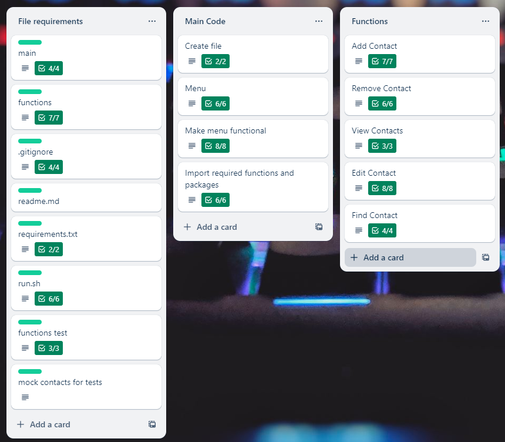

# Contact Book Application
 [Github Repository](https://github.com/forkets/Terminal_App)<br>
 [Video Presentation](https://youtu.be/D--7z3JGNtE)

## Features
- Add contacts - Allows users to add a new contact quickly and easily. There is a prompt for first name, last name, and contact number.
- Remove contacts - Allows users to remove any unwanted contacts. Simply enter the full name for the unwanted contact to remove and it will remove the whole contact.
- View contacts - Allows users to view the entire contact list.
- Find contacts - Allows users to find a specific contact using the full name. This saves manually searching a whole contact list.
- Edit contacts - Allows users to modify a contact in their list. Application prompts the user for a contact to edit, then requests new inputs for first and last names and phone number.

## Implementation Plan

A few screenshots can be found at the end of the plan.
- Create menu
    - This will be created using a function. Include options for:<br>
        - [x] adding contacts<br>
        - [x] removing contacts<br>
        - [x] viewing contacts<br>
        - [x] editing contacts<br>
        - [x] find contacts<br>
        - [x] exit prompt
- Create file
    - [x] Define file name
    - [x] Use try/except blocks to check if the file exists yet and create one if it doesn't.  
- Build Add Contacts feature
    - This will use a function called user_action_add_contact. Include options for:
        - [x] Adding first name
        - [x] Adding last name
        - [x] Adding phone number
        - [x] Inform user that the information has been stored
        - [x] Return to menu
- Build Remove Contacts feature
    - This will use a function called remove_contact_from_list.
        - [x] Prompt user for a contact name to remove
        - [x] Code will find the contact and remove it
        - [x] Print contact removed
        - [x] Inform user the contact has been removed
        - [x] Return to menu
- Build View Contacts feature
    - This will use a function called display_contact_list.
        - [x] Display entire contact list
        - [x] Prompt user to press Enter to return to menu. This avoids the menu being displayed immediately after the contact list, making it easier to read. 
- Build Edit Contacts feature
    - This will use a function called update_contact_in_list.
        - [x] Prompt user for a contact to edit
        - [x] Display contact
        - [x] Prompt user for new contact details
        - [x] Display updated contact
        - [x] Inform user the contact has been updated
        - [x] Return to menu
- Build Find Contacts feature
    - This will use a function called find_contact_in_list
        - [x] Prompt user for a contact to find
        - [x] Find requested contact
        - [x] Display contact
        - [x] Return to menu

### Project Management Plan<br>

### Functions Checklist

### Add Contacts Checklist


## How to use application
This application can be used on any standard Windows or Mac computer. It may be used in WSL (Ubuntu) or PowerShell. It is recommended to use Ubuntu.<br>

### Pre-requisites
Python 3.10+<br>
Pip dependencies - colored, pytest

To check if Python is installed, open your terminal and run ```python3 --version``` and hit enter. If Python is installed it will display the Python version you have. If your version is 3.10 or higher, you're good to go!

If Python is not installed or older than 3.10, follow this link for instructions how to install Python 3.12 (https://www.itsupportwale.com/blog/how-to-upgrade-to-python-3-12-on-ubuntu-20-04-and-22-04-lts/)

To install colored and pytest, simply run ```pip3 install colored``` and ```pip3 install pytest```

### Ubuntu Instructions
Step 1: Open the Ubuntu terminal<br>
Step 2: Navigate to the application directory folder using ```cd /path```<br>
Step 3: Type the command ```./src/run.sh```<br>
Step 4: Enjoy the application!

### PowerShell
Step 1: Open the PowerShell terminal<br>
Step 2: Navigate to the application directory folder using ```cd /path```<br>
Step 3: Run the command ```python3 main.py```<br>
Step 4: Enjoy the application!<br>